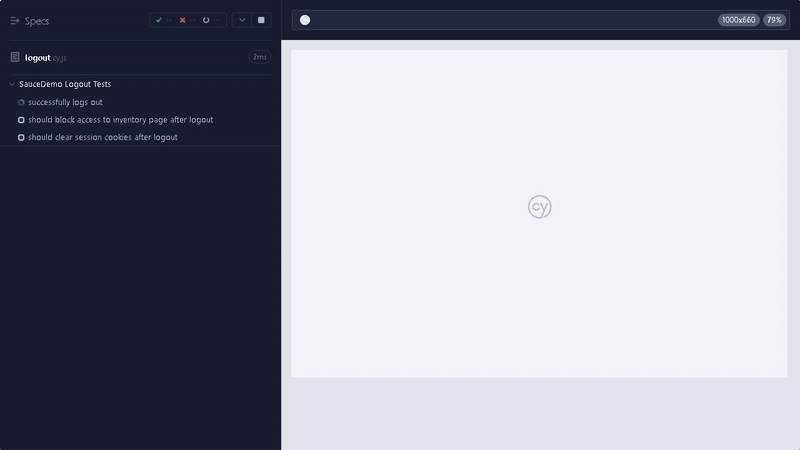

# Cypress E2E SauceDemo 🛒

## 📌 Project Overview
**`cypress-e2e-saucedemo`** is a test automation project showcasing my Cypress expertise by validating real-world e-commerce scenarios on [SauceDemo](https://www.saucedemo.com/). It demonstrates:
- ✅ **Modern testing practices** (Page Objects, AAA pattern)
- 🔒 **Security-aware testing** (masked secrets, session validation)
- 📊 **Comprehensive coverage** (happy paths, edge cases)

**View Test Plans**: Each test file has an associated **test plan**,**test demo video**, as well as option to **view test code** in this README below.

---

## 🧪 Test Plan: Login Functionality (`login.cy.js`)

### 📋 Test Coverage

| Test Scenario              | Verification Points                          | Status |
|----------------------------|---------------------------------------------|--------|
| **Happy Path Login**       | • Redirects to inventory<br>• Session established<br>• UI updates correctly | ✅     |
| **Invalid Password**       | • Error message displays<br>• No page redirect | ✅     |
| **Locked User**           | • Specific locked-out error appears<br>• Blocks navigation | ✅     |
| **Empty Field Validation** | • Required field errors appear<br>• Form blocks submission | ✅     |

### 🚀 Key Features Demonstrated
- **Credential Testing**: Validates both success and failure paths
- **Error Handling**: Verifies UI responses to invalid inputs
- **Session Management**: Confirms cookie behavior
- **Form Validation**: Tests empty submission cases

<div align="right">
<details>
<summary><b>👨‍💻 View Test Code</b></summary>
<div align="left">

```javascript
// login.cy.js
import { users } from '../fixtures/users';
import { loginSelectors, inventorySelectors } from '../support/selectors';

describe('SauceDemo Login Tests', () => {
  beforeEach(() => {
    cy.visit('/');
  });

  it('successfully logs in with valid credentials (Happy Path)', () => {
    // ACT: Login with valid credentials
    cy.get(loginSelectors.username).type(users.standard.username);
    cy.get(loginSelectors.password).type(users.standard.password, { log: false }); // Hide password in logs
    cy.get(loginSelectors.loginButton).click();

    // ASSERT: Verify successful login
    cy.url().should('include', '/inventory.html'); // Verify redirect
    cy.get(inventorySelectors.title).should('contain', 'Products'); // Verify UI update
    cy.getCookie('session-username').should('exist'); // Verify session cookie
  });

  it('displays error for invalid password', () => {
    // ACT: Login with invalid password
    cy.get(loginSelectors.username).type(users.standard.username);
    cy.get(loginSelectors.password).type('invalid_password');
    cy.get(loginSelectors.loginButton).click();

    // ASSERT: Verify error message and no redirect
    cy.url().should('eq', Cypress.config().baseUrl)
    cy.get(loginSelectors.errorMessage)
      .should('be.visible')
      .and('contain', 'Username and password do not match'); 
  });

  it('blocks locked-out users with descriptive error', () => {
    // ACT: Login with locked-out user credentials
    cy.get(loginSelectors.username).type(users.locked.username);
    cy.get(loginSelectors.password).type(users.locked.password, { log: false });
    cy.get(loginSelectors.loginButton).click();

    // ASSERT: Verify error message and no redirect
    cy.url().should('eq', Cypress.config().baseUrl);
    cy.get(loginSelectors.errorMessage)
      .should('be.visible')
      .and('contain', 'Sorry, this user has been locked out.'); 
  });

  it('validates required fields', () => {
    // ACT: Submit empty form
    cy.get(loginSelectors.loginButton).click();

    // ASSERT: Verify error message for empty username and password
    cy.get(loginSelectors.errorMessage)
      .should('be.visible')
      .and('contain', 'Username is required');
  });
});

```
</div>
</details>
</div>


---

## 🧪 Test Plan: Logout Functionality (`logout.cy.js`) 

### 📋 Test Coverage

| Test Scenario              | Verification Points                          | Status |
|----------------------------|---------------------------------------------|--------|
| **Successful Logout**      | • Returns to login page<br>• Clears session data<br>• Resets UI state | ✅     |
| **Protected Route Access** | • Blocks access to inventory<br>• Maintains login page | ✅     |
| **Session Cleanup**        | • Removes cookies<br>• Clears localStorage  | ✅     |

### 🚀 Key Features Demonstrated
- **Session Security**: Verifies complete auth teardown
- **Route Protection**: Confirms post-logout redirects
- **Storage Management**: Validates data cleanup
- **State Management**: Ensures UI resets properly

<div align="right">
<details>
<summary><b>👨‍💻 View Test Code</b></summary>
<div align="left">

```javascript
// logout.cy.js
// @ts-nocheck
import { headerSelectors, loginSelectors } from "../support/selectors";
import { users } from "../fixtures/users";

describe('SauceDemo Logout Tests', () => {
    beforeEach(() => {
        // Clear session cookies and local storage before each test
        cy.clearCookies().clearLocalStorage();

        // Login before each test
        cy.login(users.standard.username, users.standard.password);
    });

    it('successfully logs out', () => {
        // ACT: Logout
        cy.get(headerSelectors.menuButton).click();
        cy.get(headerSelectors.logoutButton).click();

        // ASSERT: Verify successful logout
        cy.url().should('eq', Cypress.config().baseUrl);
        cy.get(loginSelectors.loginButton).should('be.visible');
    });

    it('should block access to inventory page after logout', () => {
        // ACT: Logout and try to access inventory page
        cy.get(headerSelectors.menuButton).click();
        cy.get(headerSelectors.logoutButton).click();

        // ASSERT: Verify error message and no redirect
        cy.url().should('eq', Cypress.config().baseUrl);
        cy.visit('/inventory.html', {
            failOnStatusCode: false, // Allow 404/403 without failing the test
          });
        cy.get(loginSelectors.errorMessage)
            .should('be.visible')
            .and('have.text', `Epic sadface: You can only access '/inventory.html' when you are logged in.`);
    });

    it('should clear session cookies after logout', () => {
        // ACT: Logout and check session cookie
        cy.get(headerSelectors.menuButton).click();
        cy.get(headerSelectors.logoutButton).click();

        // ASSERT: Verify session cookie is cleared
        cy.getCookie('session-username').should('be.null');
    });
});

```
</div>
</details>
</div>



---

## 🧪 Test Plan: Inventory Functionality (`inventory.cy.js`)

### 📋 Test Coverage

| Test Scenario              | Verification Points                          | Status |
|----------------------------|---------------------------------------------|--------|
| **Inventory Page Render**  | • Correct page title<br>• Product list displays<br>• Cart icon visible | ✅     |
| **A-Z Sorting**            | • Products sorted alphabetically (A→Z)       | ✅     |
| **Z-A Sorting**            | • Products sorted reverse-alphabetically (Z→A)| ✅     |
| **Price Low→High**         | • Products sorted by ascending price         | ✅     |
| **Price High→Low**         | • Products sorted by descending price        | ✅     |

### 🚀 Key Features Demonstrated
- **End-to-End Testing**: Simulates real user interactions with sorting functionality
- **Data Validation**: 
  - Text comparison for name sorting
  - Numeric comparison with currency parsing for price sorting
- **Modular Design**: Reusable utility functions for sorting operations
- **Responsive Verification**: Dynamic element handling with length assertions

<div align="right">
<details>
<summary><b>👨‍💻 View Test Code</b></summary>
<div align="left">

```javascript
// inventory.cy.js
// @ts-nocheck
import { headerSelectors, inventorySelectors, loginSelectors } from "../support/selectors";
import { users } from "../fixtures/users";

const sortingOptions = {
    nameAZ: 'Name (A to Z)',
    nameZA: 'Name (Z to A)',
    priceLowHigh: 'Price (low to high)',
    priceHighLow: 'Price (high to low)'
};

const sortingUtils = {
    sortProductsBy: (sortOption) => {
        cy.get(inventorySelectors.sortDropdown).select(sortOption);
    },

    verifyProductOrder: (expectedItems) => {
        cy.get(inventorySelectors.inventoryItemName)
            .should('have.length', expectedItems.length)
            .then(($items) => {
                const actualItems = Cypress._.map($items, 'innerText');
                expect(actualItems).to.deep.equal(expectedItems);
            });
    },

    verifyPriceOrder: (expectedPrices) => {
        cy.get(inventorySelectors.inventoryItemPrice)
            .should('have.length', expectedPrices.length)
            .then(($prices) => {
                const priceTexts = Cypress._.map($prices, 'innerText');
                const actualPrices = priceTexts.map(text => {
                    const priceValue = parseFloat(text.replace('$', ''));
                    if (isNaN(priceValue)) {
                        throw new Error(`Failed to parse price from: "${text}"`);
                    }
                    return priceValue;
                });
                expect(actualPrices).to.deep.equal(expectedPrices);
            });
    }
};

describe('SauceDemo Inventory Tests', () => {
    beforeEach(() => {
        // Login before each test
        cy.login(users.standard.username, users.standard.password);
    });

    it('displays correct inventory page elements', () => {
        cy.get(inventorySelectors.title).should('contain', 'Products'); // Verify title
        cy.get(inventorySelectors.inventoryList).should('be.visible'); // Verify product list exists
        cy.get(inventorySelectors.inventoryItem).should('have.length.gt', 0); // Verify at least one product item exists
        cy.get(headerSelectors.cartIcon).should('be.visible'); // Verify cart icon exists
    });

    it('correctly sorts products by Name (A to Z)', () => {
        // ACT: Sort products by Name (A to Z)
        sortingUtils.sortProductsBy(sortingOptions.nameAZ);

        // ASSERT: Verify product order
        sortingUtils.verifyProductOrder([
            'Sauce Labs Backpack',
            'Sauce Labs Bike Light',
            'Sauce Labs Bolt T-Shirt',
            'Sauce Labs Fleece Jacket',
            'Sauce Labs Onesie',
            'Test.allTheThings() T-Shirt (Red)'
        ]);
    });

    it('correctly sorts products by Name (Z to A)', () => {
        // ACT: Sort products by Name (Z to A)
        sortingUtils.sortProductsBy(sortingOptions.nameZA);

        // ASSERT: Verify product order
        sortingUtils.verifyProductOrder([
            'Test.allTheThings() T-Shirt (Red)',
            'Sauce Labs Onesie',
            'Sauce Labs Fleece Jacket',
            'Sauce Labs Bolt T-Shirt',
            'Sauce Labs Bike Light',
            'Sauce Labs Backpack'
        ]);
    });

    it('correctly sorts products by Price (low to high)', () => {
        // ACT: Sort products by Price (low to high)
        sortingUtils.sortProductsBy(sortingOptions.priceLowHigh);

        // ASSERT: Verify product order
        sortingUtils.verifyPriceOrder([7.99, 9.99, 15.99, 15.99, 29.99, 49.99]);
    });

    it('correctly sorts products by Price (high to low)', () => {
        // ACT: Sort products by Price (high to low)
        sortingUtils.sortProductsBy(sortingOptions.priceHighLow);

        // ASSERT: Verify product order
        sortingUtils.verifyPriceOrder([49.99, 29.99, 15.99, 15.99, 9.99, 7.99]);
    });
});

```
</div>
</details>
</div>


---

## 🧪 Test Plan: Cart Functionality (`cart.cy.js`)

### 📋 Test Coverage

| Test Scenario              | Verification Points                          | Status |
|----------------------------|---------------------------------------------|--------|
| **Single Item Addition**    | • Cart badge updates<br>• Item appears in cart with correct details (name, desc, price) | ✅     |
| **Single Item Removal**     | • Cart badge disappears<br>• Item removed from cart view | ✅     |
| **Multiple Items Addition** | • Cart badge shows correct count<br>• All items appear with correct details | ✅     |
| **Full Cart Clearance**     | • Cart badge disappears<br>• All items removed from cart view | ✅     |

### 🚀 Key Features Demonstrated
- **User Flow Testing**: Simulates complete add-to-cart and checkout preparation scenarios
- **Dynamic Verification**: 
  - Real-time cart badge updates
  - Multi-item validation in single test
- **Bulk Operations**: Handles both individual and batch item management
- **Negative Assertions**: Confirms absence of elements after removal
- **Data Integrity**: Validates product details (name, description, price) persist in cart

<div align="right">
<details>
<summary><b>👨‍💻 View Test Code</b></summary>
<div align="left">

```javascript
// cart.cy.js
// @ts-nocheck
import { headerSelectors, inventorySelectors, loginSelectors, cartSelectors } from "../support/selectors";
import { users } from "../fixtures/users";
import { items } from "../fixtures/items";

describe('SauceDemo Cart Tests', () => {
    beforeEach(() => {
        // Login before each test
        cy.login(users.standard.username, users.standard.password);
    });
    
    it('adds a single item to the cart', () => {
        const itemName = 'Sauce Labs Backpack';
        
        // ACT: Add item to cart
        cy.addItemToCart(itemName);

        // ASSERT: Verify item is in cart
        cy.get(headerSelectors.shoppingCartBadge).should('be.visible').and('contain', '1');
        cy.visitCartPage();
        cy.contains(cartSelectors.cartItem, itemName)
            .should('be.visible')
            .parentsUntil(cartSelectors.cartItem)
            .should('contain', itemName)
            .and('contain', items[itemName].desc)
            .and('contain', items[itemName].price);
    });

    it('removes an item from the cart', () => {
        const itemName = 'Sauce Labs Backpack';

        // ACT: Add and then remove item from cart
        cy.addItemToCart(itemName);
        cy.visitCartPage();
        cy.get(cartSelectors.removeButton).click();

        // ASSERT: Verify item is removed from cart
        cy.get(headerSelectors.shoppingCartBadge).should('not.exist');
        cy.contains(cartSelectors.cartItem, itemName).should('not.exist');
    });

    it('adds multiple items to the cart', () => {
        const itemsToAdd = ['Sauce Labs Backpack', 'Sauce Labs Bike Light', 'Sauce Labs Bolt T-Shirt'];

        // ACT: Add multiple items to cart
        itemsToAdd.forEach(item => cy.addItemToCart(item));

        // ASSERT: Verify all items are in cart
        cy.get(headerSelectors.shoppingCartBadge).should('be.visible').and('contain', '3');
        cy.visitCartPage();
        itemsToAdd.forEach(item => {
            cy.contains(cartSelectors.cartItem, item)
            .should('be.visible')
            .parentsUntil(cartSelectors.cartItem)
            .should('contain', item)
            .and('contain', items[item].desc)
            .and('contain', items[item].price);
        });
    });

    it('removes all items from the cart', () => {
        const itemsToAdd = ['Sauce Labs Backpack', 'Sauce Labs Bike Light', 'Sauce Labs Bolt T-Shirt'];

        // ACT: Add multiple items to cart
        itemsToAdd.forEach(item => cy.addItemToCart(item));
        cy.visitCartPage();

        // Remove all items from cart
        cy.removeAllItemsFromCart();

        // ASSERT: Verify cart is empty
        cy.get(headerSelectors.shoppingCartBadge).should('not.exist');
        cy.get(cartSelectors.cartItem).should('not.exist');
    });
});

```
</div>
</details>
</div>


---

## 🌟 Project Highlights

### 🛒 Cart Functionality
- Implements **real-time cart tracking** with badge counter validation
- Tests **bulk operations** for adding/removing multiple items
- Validates **data integrity** across product pages and cart views
- Demonstrates **empty state handling** for cart clearance

### 🔐 Authentication Flows
- Covers **5 distinct login scenarios** (happy path, locked user, etc.)
- Implements **secure credential handling** with hidden password logging
- Validates **session management** through cookie verification
- Tests **protected routes** with proper error messaging

### 📊 Inventory Management
- Implements **4 sorting mechanisms** with precise validation
- Includes **currency parsing** with error handling
- Demonstrates **responsive verification** for dynamic lists
- Uses **modular utilities** for reusable sorting operations

### 🏗️ Architectural Excellence
- Follows **Cypress best practices** for selectors and commands
- Demonstrates **clean test architecture** with:
  - Separation of concerns (selectors, fixtures, tests)
  - Custom commands for common actions
  - Utility functions for complex operations
- Includes **comprehensive error handling** throughout
- Maintains **consistent test patterns** across all suites

### � Edge Case Coverage
- Tests **empty form submissions** with proper validation
- Verifies **locked user experience** with specific messaging
- Handles **price parsing edge cases** (currency symbols, NaN values)
- Validates **session cleanup** after logout

### 📈 Scalability Features
- **Data-driven testing** using fixture files
- **Reusable commands** for common workflows (login, cart ops)
- **Component-based selectors** for easy maintenance
- **Cross-suite consistency** in test structure
